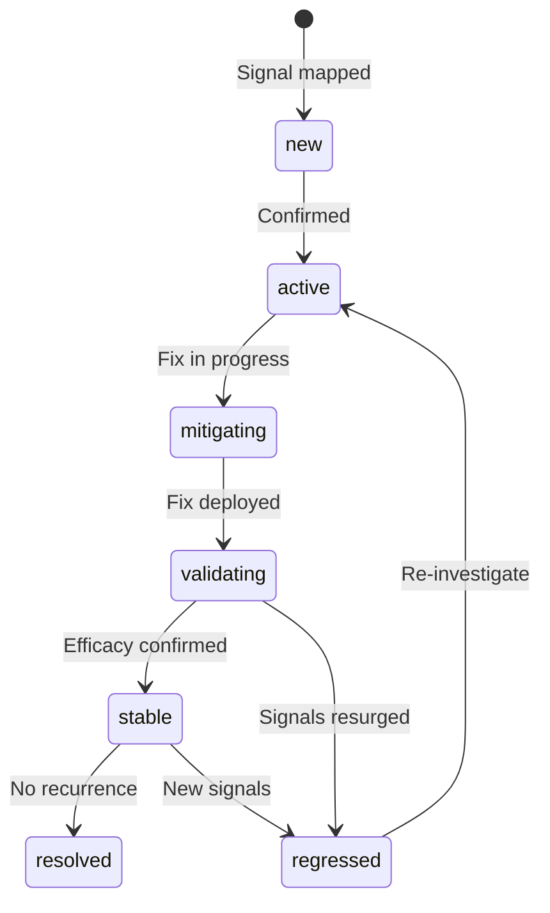
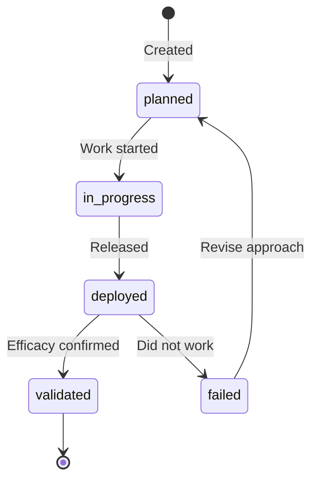

# Lifecycle States

Root causes and remediations progress through defined lifecycle states. Understanding these states is essential for tracking issue resolution and measuring operational health.

## RootCause Lifecycle

### States

| State | Description | Typical Actions |
|-------|-------------|-----------------|
| `new` | Recently identified, not yet confirmed | Review, assign owner, confirm validity |
| `active` | Confirmed issue requiring attention | Prioritize, plan remediation |
| `mitigating` | Remediation in progress | Implement fix, review PRs |
| `validating` | Fix deployed, measuring effectiveness | Monitor signal rate, collect validation signals |
| `stable` | Fix appears effective, observing | Continue monitoring for regression |
| `regressed` | Issue has recurred after stabilization | Re-analyze root cause, revise fix |
| `resolved` | Issue confirmed fixed, no recurrence | Archive, close tickets |

### State Transitions

**new → active**

- Owner assigned
- Impact assessed
- Confirmed as valid issue (not noise)

**active → mitigating**

- Remediation created and linked
- Implementation started
- Code changes in progress

**mitigating → validating**

- Fix deployed to production
- Monitoring period started
- Validation signals being collected

**validating → stable**

- Signal rate dropped significantly (e.g., >80%)
- No new related signals for defined period
- Efficacy metric meets threshold

**validating → regressed**

- Signals continued or increased after deployment
- Efficacy below threshold
- New symptoms appeared

**stable → resolved**

- Extended period without recurrence
- Related tickets closed
- Documentation updated

**stable → regressed** / **regressed → active**

- New signals matching pattern
- Recurrence detected
- Re-investigation required

## Remediation Lifecycle

### States

| State | Description |
|-------|-------------|
| `planned` | Remediation identified and scoped |
| `in_progress` | Implementation underway |
| `deployed` | Released to production |
| `validated` | Confirmed effective via validation signals |
| `failed` | Did not achieve desired outcome |

## Signal Status

Signals have simpler states reflecting their processing status:

| Status | Description |
|--------|-------------|
| `raw` | Received but not yet processed |
| `mapped` | Successfully mapped to a root cause |
| `duplicate` | Identified as duplicate of existing signal |
| `noise` | Determined to be false positive or irrelevant |

## Best Practices

!!! tip "Use Status Transitions for Metrics"
    Track time spent in each state to identify bottlenecks:

    - Mean Time to Mitigate (new → mitigating)
    - Mean Time to Validate (mitigating → stable)
    - Regression Rate (stable → regressed)

!!! warning "Don't Skip States"
    Always progress through states sequentially. Skipping states (e.g., new → resolved) loses important tracking data and breaks metrics.

!!! info "Automate Transitions"
    Where possible, automate state transitions based on signals:

    - new → active: When owner assigned via ticket system
    - mitigating → validating: When PR merged and deployed
    - validating → stable: When signal rate drops below threshold
