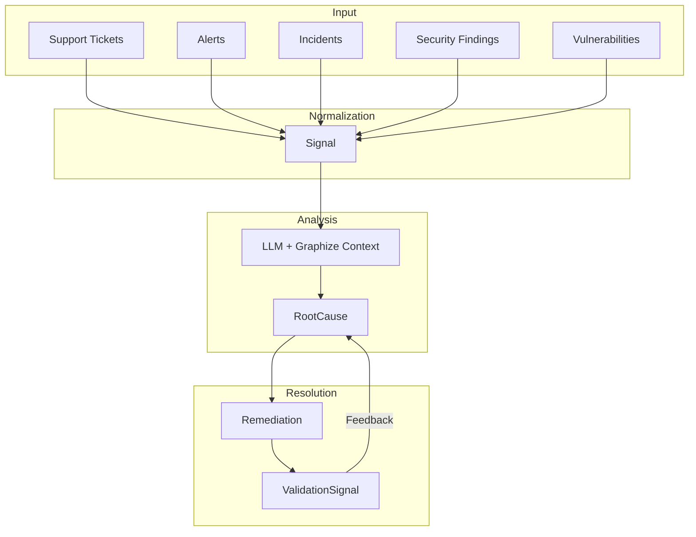
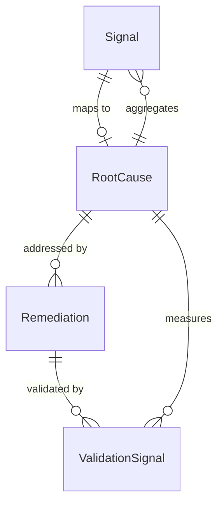

# Overview

Signal Spec defines the canonical data model for operational intelligence. It provides schemas and types for normalizing operational observations from diverse sources into a unified format for correlation, root cause analysis, and remediation tracking.

## Core Entities

### Signal

An atomic operational observation from an external system. Signals are the **input layer** - raw events normalized from various sources.

**Sources include:**

- Support tickets
- Cloud incidents
- Security findings
- Posture drift detections
- Alerts and outages
- Vulnerability scans
- Customer feedback

**Key characteristics:**

- Ephemeral observations
- Externally sourced
- Normalized into canonical format
- Contain embeddings for semantic similarity

### RootCause

A persistent clustered operational issue. Root causes are the **primary analytical asset** - durable entities that aggregate evidence and track lifecycle.

**Key characteristics:**

- Managed, persistent entities
- Aggregate multiple signals
- Track lifecycle state (new → active → mitigating → resolved)
- Enable prioritization based on impact
- Detect recurrence and regression

### Remediation

A corrective action targeting one or more root causes. Remediations enable **closed-loop validation** - measuring whether fixes actually worked.

**Key characteristics:**

- Track implementation lifecycle
- Link to code changes, PRs, incidents
- Measure efficacy post-deployment
- Detect regression

### ValidationSignal

Evidence of remediation effectiveness. Generated after deployment to measure signal decay or resurgence.

## Data Flow

## LLM Integration

The mapping from Signal to RootCause is performed by LLM analysis with access to:

1. **Raw signal data** - The normalized signal content
2. **Historical patterns** - Previous signals and root causes
3. **Codebase context** - Via [graphize](https://github.com/plexusone/graphize) knowledge graphs
4. **Documentation** - System docs and runbooks

This is orchestrated externally to the spec - the spec defines the contracts, not the mapping logic.

## Design Principles

| Principle | Description |
|-----------|-------------|
| **Go types are source of truth** | JSON schemas are generated from Go structs |
| **Signals are observations** | They flow in and get mapped, not managed |
| **Root causes are durable** | They persist, evolve, and track lifecycle |
| **Closed-loop validation** | Measure whether fixes work |
| **Semantic consistency** | Enable longitudinal analytics |

## Entity Relationships

