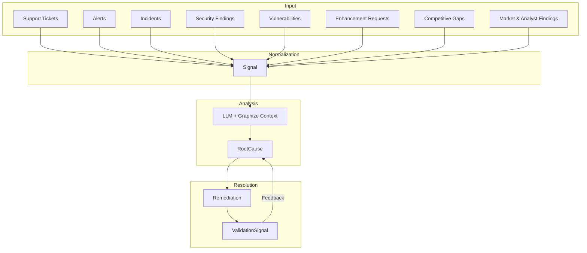
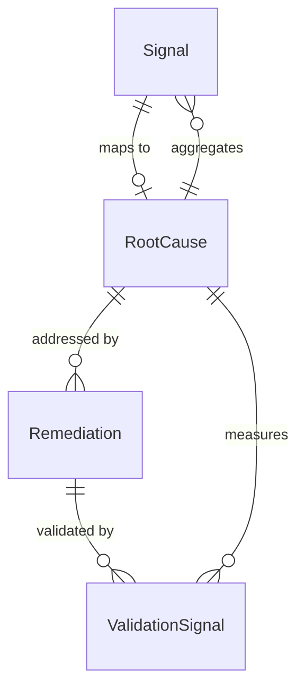

# Overview

Signal Spec defines the canonical data model for operational **and product** intelligence. It provides schemas and types for normalizing observations from diverse sources — incidents, tickets, findings, feature requests, competitive intel, and analyst research — into a unified format for correlation, root cause analysis, remediation tracking, and product/market prioritization.

## Core Entities

### Signal

An atomic observation from an external system. Signals are the **input layer** - raw events normalized from various sources.

**Sources include:**

Operational:

- Support tickets
- Cloud incidents
- Security findings
- Posture drift detections
- Alerts and outages
- Vulnerability scans
- Customer feedback

Product and market:

- Enhancement requests (feature request boards, CS escalations)
- Competitive gaps (win/loss analysis)
- Competitor launches (product announcements)
- Analyst findings (Gartner, Forrester, and similar reports)
- Market observations (general market trends)

**Key characteristics:**

- Ephemeral observations
- Externally sourced
- Normalized into canonical format
- Contain embeddings for semantic similarity

### RootCause

A persistent clustered issue — operational (e.g., an incident pattern) or product-oriented (e.g., a recurring feature gap). Root causes are the **primary analytical asset** - durable entities that aggregate evidence and track lifecycle.

**Key characteristics:**

- Managed, persistent entities
- Aggregate multiple signals
- Track lifecycle state (new → active → mitigating → resolved)
- Enable prioritization based on impact
- Detect recurrence and regression

### Remediation

A corrective action targeting one or more root causes. Remediations enable **closed-loop validation** - measuring whether fixes actually worked.

**Key characteristics:**

- Track implementation lifecycle
- Link to code changes, PRs, incidents
- Measure efficacy post-deployment
- Detect regression

### ValidationSignal

Evidence of remediation effectiveness. Generated after deployment to measure signal decay or resurgence.

## Product & Market Intelligence

Alongside operational signal types, Signal Spec defines five `signal.Type` values for product and market intelligence:

| Type | Description |
|------|--------------|
| `enhancement_request` | Customer feature request (feature board, CS escalation, sales opportunity) |
| `competitive_gap` | Gap vs. a competitor identified from win/loss analysis |
| `competitor_launch` | Competitor product announcement |
| `analyst_finding` | Insight extracted from an analyst report (Gartner, Forrester, etc.) |
| `market_observation` | General market trend |

These signals flow through the same normalization, correlation, and root-cause pipeline as operational signals — a cluster of `enhancement_request` signals can become a `RootCause` just like a cluster of `support_ticket` signals, enabling apples-to-apples prioritization across operational and product work.

Product signals typically carry two kinds of extra structure that operational signals don't need:

- **Structured metadata** - well-known `Metadata` keys (votes, subscribers, requesting organizations, named customers, linked sales opportunities, estimated ARR at stake). See [Enhancement Signal Metadata](../schemas/signal.md#enhancement-signal-metadata).
- **Cross-repo references** - typed references (via [`pkg/ref`](../schemas/ref.md)) that link a signal or entity to canonical definitions owned by other repositories, such as a market in MarketSpec or a customer in OrganizationSpec.

## Data Flow

## LLM Integration

The mapping from Signal to RootCause is performed by LLM analysis with access to:

1. **Raw signal data** - The normalized signal content
2. **Historical patterns** - Previous signals and root causes
3. **Codebase context** - Via [graphize](https://github.com/plexusone/graphize) knowledge graphs
4. **Documentation** - System docs and runbooks

This is orchestrated externally to the spec - the spec defines the contracts, not the mapping logic.

## Design Principles

| Principle | Description |
|-----------|-------------|
| **Go types are source of truth** | JSON schemas are generated from Go structs |
| **Signals are observations** | They flow in and get mapped, not managed |
| **Root causes are durable** | They persist, evolve, and track lifecycle |
| **Closed-loop validation** | Measure whether fixes work |
| **Semantic consistency** | Enable longitudinal analytics |

## Entity Relationships

