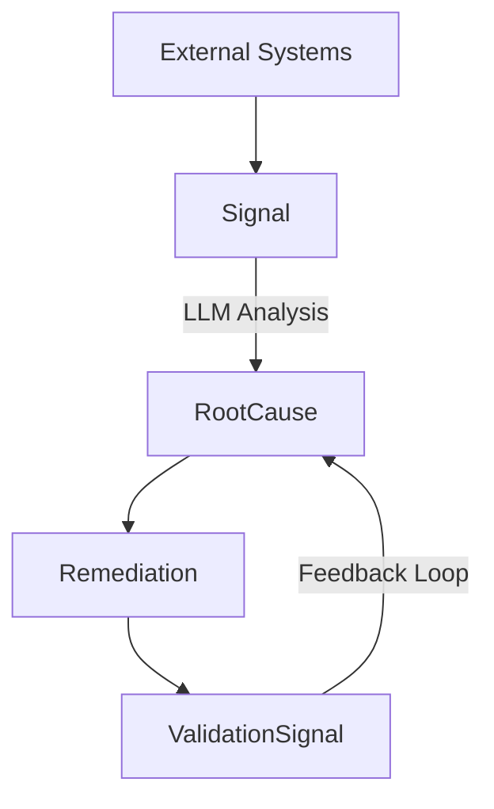

# Signal Spec

Canonical data model for operational intelligence.

## What is Signal Spec?

Signal Spec defines the schemas and types for normalizing operational observations from diverse sources into a unified format. It enables correlation, root cause analysis, and remediation tracking across your operational landscape.

## Core Entities

| Entity | Purpose |
|--------|---------|
| **Signal** | Normalized operational observations (tickets, alerts, incidents, findings) |
| **RootCause** | Persistent clustered issues with lifecycle tracking |
| **Remediation** | Corrective actions with efficacy measurement |
| **ValidationSignal** | Evidence of fix effectiveness |

## Data Flow



## Quick Start

### Install CLI

```bash
go install github.com/plexusone/signal-spec/cmd/signal-spec@latest
```

### Validate a Signal

```bash
signal-spec validate -t signal signal.json
```

### Generate Report

```bash
signal-spec report -i rootcauses.json -o summary.xlsx
```

## Key Features

- **Go types as source of truth** - JSON schemas generated from Go structs
- **Lifecycle tracking** - Monitor issues from detection through resolution
- **Closed-loop validation** - Measure whether fixes actually work
- **Domain taxonomy** - Categorize issues by domain/subdomain for prioritization
- **Impact metrics** - Quantify customer and business impact

## Installation

=== "Go"

    ```bash
    go get github.com/plexusone/signal-spec
    ```

=== "JSON Schema"

    Download schemas from [GitHub releases](https://github.com/plexusone/signal-spec/releases) or generate:

    ```bash
    signal-spec schema generate -o ./schemas/
    ```

## Next Steps

- [Concepts Overview](concepts/overview.md) - Understand the data model
- [Schema Reference](schemas/signal.md) - Detailed type documentation
- [Integration Guide](integration/producing.md) - Start producing signals
