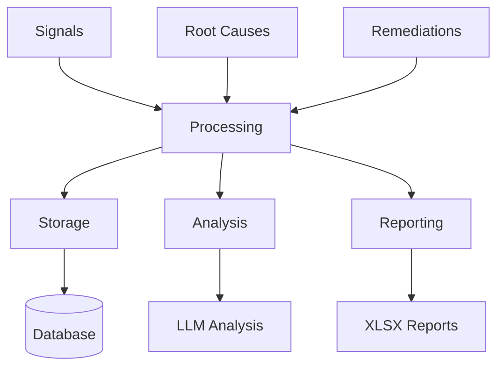

# Consuming Data

This guide covers how to consume and process signal-spec data for analysis, storage, and reporting.

## Overview

Signal-spec data flows through multiple consumption patterns:



## Loading Data

### From JSON Files

```go
import (
    "encoding/json"
    "os"

    "github.com/plexusone/signal-spec/pkg/rootcause"
)

func LoadRootCauses(filename string) ([]rootcause.RootCause, error) {
    data, err := os.ReadFile(filename)
    if err != nil {
        return nil, err
    }

    var rcs []rootcause.RootCause
    if err := json.Unmarshal(data, &rcs); err != nil {
        // Try single object
        var rc rootcause.RootCause
        if err := json.Unmarshal(data, &rc); err != nil {
            return nil, err
        }
        return []rootcause.RootCause{rc}, nil
    }

    return rcs, nil
}
```

### Using the Export Package

```go
import "github.com/plexusone/signal-spec/pkg/export"

// Load from file
rcs, err := export.LoadRootCausesFromFile("rootcauses.json")

// Load from directory
rcs, err := export.LoadRootCausesFromDir("./rootcauses/")
```

## Storage Patterns

### Relational Database

Map signal-spec types to relational tables:

```sql
CREATE TABLE signals (
    id VARCHAR(255) PRIMARY KEY,
    type VARCHAR(50) NOT NULL,
    status VARCHAR(50) NOT NULL,
    source_type VARCHAR(100),
    source_name VARCHAR(100),
    source_external_id VARCHAR(255),
    domain_name VARCHAR(100) NOT NULL,
    domain_subdomain VARCHAR(100),
    severity VARCHAR(20) NOT NULL,
    summary TEXT NOT NULL,
    description TEXT,
    observed_at TIMESTAMP NOT NULL,
    received_at TIMESTAMP NOT NULL,
    root_cause_id VARCHAR(255),
    fingerprint VARCHAR(255),
    metadata JSONB,
    tags TEXT[],
    created_at TIMESTAMP DEFAULT NOW()
);

CREATE TABLE root_causes (
    id VARCHAR(255) PRIMARY KEY,
    title TEXT NOT NULL,
    description TEXT,
    status VARCHAR(50) NOT NULL,
    domain_name VARCHAR(100) NOT NULL,
    domain_subdomain VARCHAR(100),
    severity VARCHAR(20) NOT NULL,
    signal_count INTEGER DEFAULT 0,
    priority_score INTEGER,
    first_seen TIMESTAMP,
    last_seen TIMESTAMP,
    owner_team VARCHAR(100),
    remediation_id VARCHAR(255),
    recurrence_count INTEGER DEFAULT 0,
    metadata JSONB,
    tags TEXT[],
    created_at TIMESTAMP DEFAULT NOW()
);

CREATE INDEX idx_signals_domain ON signals(domain_name, domain_subdomain);
CREATE INDEX idx_signals_root_cause ON signals(root_cause_id);
CREATE INDEX idx_root_causes_status ON root_causes(status);
CREATE INDEX idx_root_causes_severity ON root_causes(severity);
```

### Document Database

Store as JSON documents with appropriate indexes:

```javascript
// MongoDB example
db.signals.createIndex({ "domain.name": 1, "domain.subdomain": 1 });
db.signals.createIndex({ "root_cause_id": 1 });
db.signals.createIndex({ "observed_at": -1 });

db.rootCauses.createIndex({ "status": 1 });
db.rootCauses.createIndex({ "domain.name": 1 });
db.rootCauses.createIndex({ "priority_score": -1 });
```

## Querying Patterns

### Find Signals by Domain

```go
func SignalsByDomain(domain, subdomain string) ([]signal.Signal, error) {
    query := `
        SELECT * FROM signals
        WHERE domain_name = $1
        AND ($2 = '' OR domain_subdomain = $2)
        ORDER BY observed_at DESC
    `
    // Execute query...
}
```

### Aggregate by Domain

```go
func AggregateByDomain(rcs []rootcause.RootCause) map[string]int {
    counts := make(map[string]int)
    for _, rc := range rcs {
        key := rc.Domain.Name + "|" + rc.Domain.Subdomain
        counts[key]++
    }
    return counts
}
```

### Filter by Status

```go
func ActiveRootCauses(rcs []rootcause.RootCause) []rootcause.RootCause {
    var active []rootcause.RootCause
    for _, rc := range rcs {
        switch rc.Status {
        case rootcause.StatusNew,
             rootcause.StatusActive,
             rootcause.StatusMitigating:
            active = append(active, rc)
        }
    }
    return active
}
```

## Generating Reports

### XLSX Summary Report

```go
import "github.com/plexusone/signal-spec/pkg/export"

// Load root causes
rcs, err := export.LoadRootCausesFromFile("rootcauses.json")
if err != nil {
    log.Fatal(err)
}

// Build summary report
report := export.BuildSummaryReport(rcs)

// Optionally apply leader mappings
leaders, _ := export.LoadLeaderMappings("leaders.json")
if leaders != nil {
    leaders.Apply(report)
}

// Write XLSX
if err := report.WriteXLSX("summary.xlsx"); err != nil {
    log.Fatal(err)
}
```

### Using CLI

```bash
# Basic report
signal-spec report -i rootcauses.json -o summary.xlsx

# With leader mappings
signal-spec report -i rootcauses.json --leaders leaders.json -o summary.xlsx

# From directory of files
signal-spec report -d ./rootcauses/ -o summary.xlsx
```

## Analytics Queries

### Top Issues by Signal Count

```sql
SELECT
    domain_name,
    domain_subdomain,
    title,
    signal_count,
    priority_score
FROM root_causes
WHERE status IN ('new', 'active', 'mitigating')
ORDER BY signal_count DESC
LIMIT 10;
```

### Trend Analysis

```sql
SELECT
    DATE_TRUNC('day', observed_at) as day,
    domain_name,
    COUNT(*) as signal_count
FROM signals
WHERE observed_at > NOW() - INTERVAL '30 days'
GROUP BY day, domain_name
ORDER BY day, domain_name;
```

### Remediation Effectiveness

```sql
SELECT
    r.id,
    r.title,
    r.status,
    COUNT(DISTINCT s.id) as pre_deploy_signals,
    AVG(vs.reduction_percent) as avg_reduction
FROM remediations r
LEFT JOIN signals s ON s.root_cause_id = ANY(r.root_cause_ids)
    AND s.observed_at < r.deployed_at
LEFT JOIN validation_signals vs ON vs.remediation_id = r.id
WHERE r.deployed_at IS NOT NULL
GROUP BY r.id, r.title, r.status;
```

## Event Processing

### Stream Processing

```go
func ProcessSignalStream(signals <-chan *signal.Signal) {
    for sig := range signals {
        // Validate
        if err := validateSignal(sig); err != nil {
            log.Printf("invalid signal: %v", err)
            continue
        }

        // Store
        if err := storeSignal(sig); err != nil {
            log.Printf("storage error: %v", err)
            continue
        }

        // Trigger analysis
        triggerRootCauseAnalysis(sig)
    }
}
```

### Webhook Handler

```go
func HandleSignalWebhook(w http.ResponseWriter, r *http.Request) {
    var sig signal.Signal
    if err := json.NewDecoder(r.Body).Decode(&sig); err != nil {
        http.Error(w, err.Error(), http.StatusBadRequest)
        return
    }

    sig.ReceivedAt = time.Now()
    sig.Status = signal.StatusNew

    if err := processSignal(&sig); err != nil {
        http.Error(w, err.Error(), http.StatusInternalServerError)
        return
    }

    w.WriteHeader(http.StatusAccepted)
}
```

## Best Practices

!!! tip "Index Appropriately"
    Create indexes on commonly queried fields: domain, status, severity, timestamps.

!!! tip "Partition by Time"
    For high-volume signal tables, partition by `observed_at` for efficient querying and archival.

!!! warning "Handle Missing Fields"
    Optional fields may be null/empty. Always check before using.

!!! info "Cache Aggregations"
    Domain summaries and counts can be expensive. Cache or pre-compute for dashboards.
