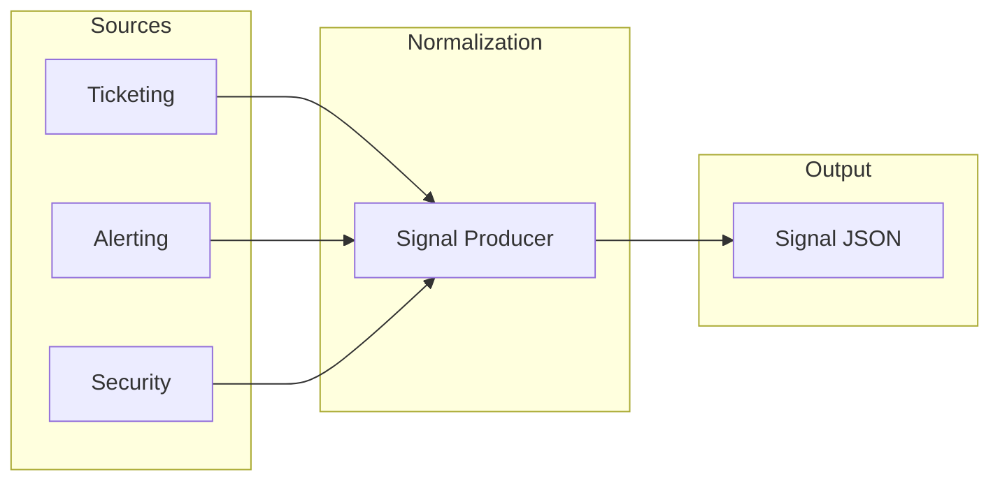

# Producing Signals

This guide covers how to emit signals from your systems into the signal-spec format.

## Overview

Signals are the entry point to the operational intelligence pipeline. They represent raw observations from various sources that need to be normalized into a canonical format.



## Basic Signal Structure

At minimum, a signal requires:

```json
{
  "id": "sig-2024-001234",
  "type": "support_ticket",
  "status": "new",
  "source": {
    "type": "ticketing",
    "name": "zendesk"
  },
  "domain": {
    "name": "authentication"
  },
  "severity": "high",
  "summary": "OAuth refresh token failures",
  "observed_at": "2024-03-15T14:30:00Z",
  "received_at": "2024-03-15T14:35:22Z"
}
```

## Go Producer

```go
package main

import (
    "encoding/json"
    "time"

    "github.com/plexusone/signal-spec/pkg/signal"
    "github.com/plexusone/signal-spec/pkg/common"
)

func NewSignalFromTicket(ticket *Ticket) *signal.Signal {
    return &signal.Signal{
        ID:     generateSignalID(),
        Type:   signal.TypeSupportTicket,
        Status: signal.StatusNew,
        Source: common.SourceSystem{
            Type:       "ticketing",
            Name:       "zendesk",
            ExternalID: ticket.ID,
            URL:        ticket.URL,
        },
        Domain: common.Domain{
            Name:      mapToDomain(ticket.Category),
            Subdomain: mapToSubdomain(ticket.Subcategory),
        },
        Severity:    mapSeverity(ticket.Priority),
        Summary:     ticket.Subject,
        Description: ticket.Description,
        ObservedAt:  ticket.CreatedAt,
        ReceivedAt:  time.Now(),
        Tags:        extractTags(ticket),
    }
}
```

## Source-Specific Mapping

### Support Tickets

Map ticket fields to signal fields:

| Ticket Field | Signal Field |
|--------------|--------------|
| Ticket ID | `source.external_id` |
| Subject | `summary` |
| Description | `description` |
| Priority | `severity` |
| Category | `domain.name` |
| Created At | `observed_at` |

### Alerts

Map alert fields:

| Alert Field | Signal Field |
|-------------|--------------|
| Alert ID | `source.external_id` |
| Alert Name | `summary` |
| Description | `description` |
| Severity | `severity` |
| Service | `entities[0]` |
| Triggered At | `observed_at` |

### Security Findings

Map security finding fields:

| Finding Field | Signal Field |
|---------------|--------------|
| Finding ID | `source.external_id` |
| Title | `summary` |
| Description | `description` |
| Severity | `severity` |
| Resource | `entities[0]` |
| Detected At | `observed_at` |

## Producing Product Signals

The five product signal types (`enhancement_request`, `competitive_gap`, `competitor_launch`, `analyst_finding`, `market_observation`) are produced the same way as operational signals, but typically populate two additional areas:

- **`Metadata`** with the well-known keys defined by `signal.Meta*` constants (see [Enhancement Signal Metadata](../schemas/signal.md#enhancement-signal-metadata))
- **`Entity.Ref` / `Metadata` typed references** in `{type}:{slug}` format via [`pkg/ref`](../schemas/ref.md), linking the signal to canonical entities owned by other repositories (customers, markets, competitors, capabilities, analyst reports)

### Enhancement Requests

Map feature request board fields to signal fields, including the structured product metadata keys:

| Source Field | Signal Field |
|--------------|--------------|
| Feature ID | `source.external_id` |
| Title | `summary` |
| Description | `description` |
| Vote count | `metadata.votes` (`signal.MetaVotes`) |
| Watcher/subscriber count | `metadata.subscribers` (`signal.MetaSubscribers`) |
| Requesting organizations | `metadata.organizations` (`signal.MetaOrganizations`) |
| Named customers | `metadata.customers` (`signal.MetaCustomers`) |
| Linked sales opportunities | `metadata.opportunities` (`signal.MetaOpportunities`) |
| Estimated ARR at stake | `metadata.estimated_arr` (`signal.MetaEstimatedARR`, in cents) |
| Affected capability | `metadata.capability_ref` (`signal.MetaCapabilityRef`) or `entities[].ref` |

```go
sig := signal.Signal{
    ID:     generateSignalID(),
    Type:   signal.TypeEnhancementRequest,
    Status: signal.StatusNew,
    Source: common.SourceSystem{
        Type:       "feedback",
        Name:       "productboard",
        ExternalID: feature.ID,
        URL:        feature.URL,
    },
    Domain: common.Domain{
        Name:      mapToDomain(feature.Category),
        Subdomain: mapToSubdomain(feature.Subcategory),
    },
    Severity:    mapImpactToSeverity(feature.Impact),
    Summary:     feature.Title,
    Description: feature.Description,
    Entities: []common.Entity{
        {Type: "capability", Name: feature.Capability, Ref: string(ref.New(ref.TypeCapability, feature.CapabilitySlug))},
    },
    ObservedAt: feature.CreatedAt,
    ReceivedAt: time.Now(),
    Metadata: map[string]any{
        signal.MetaVotes:         feature.VoteCount,
        signal.MetaSubscribers:   feature.SubscriberCount,
        signal.MetaOrganizations: feature.RequestingOrgs,
        signal.MetaCustomers:     feature.CustomerIDs,
        signal.MetaOpportunities: feature.LinkedOpportunityIDs,
        signal.MetaEstimatedARR:  feature.EstimatedARRCents,
        signal.MetaCapabilityRef: string(ref.New(ref.TypeCapability, feature.CapabilitySlug)),
        signal.MetaMarketRef:     string(ref.New(ref.TypeMarket, feature.MarketSlug)),
    },
}
```

### Competitive Gaps

Map win/loss analysis fields, referencing the losing competitor:

| Source Field | Signal Field |
|--------------|--------------|
| Call/deal ID | `source.external_id` |
| Loss reason summary | `summary` |
| Interview transcript excerpt | `description` |
| Losing competitor | `metadata.competitor_ref` (`signal.MetaCompetitorRef`) or `entities[].ref` |
| Deal size | `metadata.estimated_arr` (`signal.MetaEstimatedARR`) |
| Account name | `metadata.organizations` (`signal.MetaOrganizations`) |

```go
sig := signal.Signal{
    Type:   signal.TypeCompetitiveGap,
    Status: signal.StatusNew,
    Entities: []common.Entity{
        {Type: "competitor", Name: deal.CompetitorName, Ref: string(ref.New(ref.TypeCompetitor, deal.CompetitorSlug))},
    },
    Metadata: map[string]any{
        signal.MetaCompetitorRef: string(ref.New(ref.TypeCompetitor, deal.CompetitorSlug)),
        signal.MetaMarketRef:     string(ref.New(ref.TypeMarket, deal.MarketSlug)),
        signal.MetaEstimatedARR:  deal.ValueCents,
        signal.MetaOrganizations: []string{deal.AccountName},
    },
}
```

### Competitor Launches

Map competitor intel feed fields:

| Source Field | Signal Field |
|--------------|--------------|
| Announcement ID | `source.external_id` |
| Headline | `summary` |
| Announcement body | `description` |
| Announced competitor | `metadata.competitor_ref` (`signal.MetaCompetitorRef`) or `entities[].ref` |
| Affected market | `metadata.market_ref` (`signal.MetaMarketRef`) |
| Announcement date | `observed_at` |

### Analyst Findings

Map analyst report extraction fields:

| Source Field | Signal Field |
|--------------|--------------|
| Report ID | `source.external_id` |
| Finding headline | `summary` |
| Finding excerpt | `description` |
| Report reference | `metadata.analyst_report_ref` (`signal.MetaAnalystReportRef`) or `entities[].ref` |
| Affected market | `metadata.market_ref` (`signal.MetaMarketRef`) |
| Publication date | `observed_at` |

### Market Observations

Map market research fields:

| Source Field | Signal Field |
|--------------|--------------|
| Observation ID | `source.external_id` |
| Trend summary | `summary` |
| Supporting evidence | `description` |
| Affected market | `metadata.market_ref` (`signal.MetaMarketRef`) or `entities[].ref` |
| Observation date | `observed_at` |

## ID Generation

Signal IDs should be:

- Unique across all signals
- Deterministic (same input = same ID) for deduplication
- Human-readable prefix recommended

```go
func generateSignalID() string {
    return fmt.Sprintf("sig-%s-%s",
        time.Now().Format("2006"),
        uuid.New().String()[:8],
    )
}
```

## Deduplication

Use the `fingerprint` field to identify duplicate signals:

```go
func computeFingerprint(sig *signal.Signal) string {
    data := fmt.Sprintf("%s|%s|%s|%s",
        sig.Source.Name,
        sig.Source.ExternalID,
        sig.Summary,
        sig.ObservedAt.Format(time.RFC3339),
    )
    hash := sha256.Sum256([]byte(data))
    return fmt.Sprintf("sha256:%x", hash[:8])
}
```

## Entity Extraction

Extract referenced entities from signal content:

```go
func extractEntities(description string) []common.Entity {
    var entities []common.Entity

    // Extract service names
    servicePattern := regexp.MustCompile(`service[:\s]+([a-z0-9-]+)`)
    if matches := servicePattern.FindStringSubmatch(description); len(matches) > 1 {
        entities = append(entities, common.Entity{
            Type: "service",
            Name: matches[1],
        })
    }

    return entities
}
```

## Severity Mapping

Map source-specific severity to signal-spec severity:

| Source Severity | Signal Severity |
|-----------------|-----------------|
| P0, Critical, Sev1 | `critical` |
| P1, High, Sev2 | `high` |
| P2, Medium, Sev3 | `medium` |
| P3, Low, Sev4 | `low` |
| P4, Info | `info` |

## Batch Processing

For high-volume sources, batch signals:

```go
func ProcessBatch(tickets []*Ticket) []*signal.Signal {
    signals := make([]*signal.Signal, 0, len(tickets))

    for _, ticket := range tickets {
        sig := NewSignalFromTicket(ticket)
        sig.Fingerprint = computeFingerprint(sig)
        signals = append(signals, sig)
    }

    return signals
}
```

## Validation Before Emission

Always validate before emitting:

```go
func emitSignal(sig *signal.Signal) error {
    // Validate required fields
    if sig.ID == "" {
        return errors.New("id is required")
    }
    if sig.Summary == "" {
        return errors.New("summary is required")
    }
    if sig.Domain.Name == "" {
        return errors.New("domain.name is required")
    }

    // Validate tags
    if err := common.ValidateTags(sig.Tags); err != nil {
        return err
    }

    // Emit to queue/storage
    return publish(sig)
}
```

Or use the CLI:

```bash
signal-spec validate -t signal signal.json
```

## Best Practices

!!! tip "Preserve Original Data"
    Store source-specific data in `metadata` to preserve context:

    ```json
    {
      "metadata": {
        "zendesk_ticket_type": "incident",
        "zendesk_via": "email",
        "original_assignee": "support-team"
      }
    }
    ```

!!! tip "Use Consistent Domain Names"
    Establish a domain taxonomy and use it consistently across all signal sources.

!!! warning "Don't Over-Extract Entities"
    Only extract entities that are clearly referenced. False positives reduce signal quality.

!!! info "Set Status Appropriately"
    New signals should have `status: new`. Only set `mapped` after root cause analysis.
