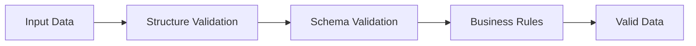

# Validation

This guide covers validating signal-spec data against schemas and business rules.

## Overview

Validation ensures data quality at multiple levels:



## CLI Validation

The `signal-spec` CLI provides built-in validation:

```bash
# Validate a signal
signal-spec validate -t signal signal.json

# Validate a root cause
signal-spec validate -t rootcause rootcause.json

# Validate a remediation
signal-spec validate -t remediation remediation.json
```

### Output

**Valid:**
```
Valid signal: signal.json
```

**Invalid:**
```
Validation failed for signal.json:
  - id is required
  - domain.name is required
  - tag "Invalid_Tag" is not valid lower-kebab-case
```

## Programmatic Validation

### Go Validation

```go
import (
    "github.com/plexusone/signal-spec/pkg/signal"
    "github.com/plexusone/signal-spec/pkg/common"
)

func ValidateSignal(s *signal.Signal) []string {
    var errors []string

    // Required fields
    if s.ID == "" {
        errors = append(errors, "id is required")
    }
    if s.Type == "" {
        errors = append(errors, "type is required")
    }
    if s.Summary == "" {
        errors = append(errors, "summary is required")
    }
    if s.Domain.Name == "" {
        errors = append(errors, "domain.name is required")
    }

    // Tag validation
    if err := common.ValidateTags(s.Tags); err != nil {
        errors = append(errors, err.Error())
    }

    return errors
}
```

### JSON Schema Validation

Generate and use JSON schemas:

```bash
# Generate schemas
signal-spec schema generate -o ./schemas/
```

Then validate with any JSON Schema validator:

=== "Python"

    ```python
    import jsonschema
    import json

    with open('schemas/signal.schema.json') as f:
        schema = json.load(f)

    with open('signal.json') as f:
        data = json.load(f)

    jsonschema.validate(data, schema)
    ```

=== "JavaScript"

    ```javascript
    const Ajv = require('ajv');
    const ajv = new Ajv();

    const schema = require('./schemas/signal.schema.json');
    const validate = ajv.compile(schema);

    const data = require('./signal.json');
    const valid = validate(data);

    if (!valid) {
        console.log(validate.errors);
    }
    ```

=== "Go"

    ```go
    import "github.com/santhosh-tekuri/jsonschema/v5"

    schema, _ := jsonschema.Compile("schemas/signal.schema.json")

    var data interface{}
    json.Unmarshal(input, &data)

    if err := schema.Validate(data); err != nil {
        log.Printf("validation error: %v", err)
    }
    ```

## Validation Rules

### Signal

| Field | Rule |
|-------|------|
| `id` | Required, non-empty |
| `type` | Required, valid enum value |
| `summary` | Required, non-empty |
| `domain.name` | Required, non-empty |
| `tags` | Each must be lowercase kebab-case |
| `observed_at` | Required, valid ISO 8601 datetime |
| `received_at` | Required, valid ISO 8601 datetime |

### RootCause

| Field | Rule |
|-------|------|
| `id` | Required, non-empty |
| `title` | Required, non-empty |
| `domain.name` | Required, non-empty |
| `tags` | Each must be lowercase kebab-case |

### Remediation

| Field | Rule |
|-------|------|
| `id` | Required, non-empty |
| `title` | Required, non-empty |
| `root_cause_ids` | Required, at least one ID |
| `tags` | Each must be lowercase kebab-case |

## Tag Validation

Tags must be lowercase kebab-case:

```
^[a-z][a-z0-9]*(-[a-z0-9]+)*$
```

### Valid Tags

- `auth`
- `redis-cluster`
- `p0-incident`
- `enterprise-impact`
- `q4-2024`

### Invalid Tags

| Tag | Problem |
|-----|---------|
| `Auth` | Uppercase |
| `redis_cluster` | Underscore |
| `-invalid` | Leading hyphen |
| `123start` | Starts with number |
| `too--many` | Double hyphen |

### Validation Code

```go
import "github.com/grokify/mogo/text/stringcase"

func ValidateTag(tag string) error {
    if !stringcase.IsKebabCase(tag) {
        return fmt.Errorf("tag %q is not valid lower-kebab-case", tag)
    }
    return nil
}
```

## Enum Validation

Ensure enum values are valid:

### Signal Type

```go
func ValidateSignalType(t signal.Type) bool {
    switch t {
    case signal.TypeSupportTicket,
         signal.TypeCloudIncident,
         signal.TypeSecurityFinding,
         signal.TypePostureDrift,
         signal.TypeAlert,
         signal.TypeOutage,
         signal.TypeVulnerability,
         signal.TypeFeedback:
        return true
    }
    return false
}
```

### Severity

```go
func ValidateSeverity(s common.Severity) bool {
    switch s {
    case common.SeverityCritical,
         common.SeverityHigh,
         common.SeverityMedium,
         common.SeverityLow,
         common.SeverityInfo:
        return true
    }
    return false
}
```

## Business Rule Validation

Beyond schema validation, apply business rules:

### Temporal Consistency

```go
func ValidateTemporalConsistency(s *signal.Signal) error {
    if s.ReceivedAt.Before(s.ObservedAt) {
        return errors.New("received_at cannot be before observed_at")
    }
    return nil
}
```

### Domain Taxonomy

```go
var validDomains = map[string][]string{
    "authentication": {"oauth", "sso", "mfa", "session"},
    "payments":       {"checkout", "subscriptions", "refunds"},
    "infrastructure": {"kubernetes", "networking", "compute"},
}

func ValidateDomain(d common.Domain) error {
    subdomains, ok := validDomains[d.Name]
    if !ok {
        return fmt.Errorf("unknown domain: %s", d.Name)
    }

    if d.Subdomain != "" {
        found := false
        for _, sd := range subdomains {
            if sd == d.Subdomain {
                found = true
                break
            }
        }
        if !found {
            return fmt.Errorf("unknown subdomain %s for domain %s",
                d.Subdomain, d.Name)
        }
    }

    return nil
}
```

### Referential Integrity

```go
func ValidateRootCauseReference(sig *signal.Signal, rcs map[string]*rootcause.RootCause) error {
    if sig.RootCauseID != "" {
        if _, exists := rcs[sig.RootCauseID]; !exists {
            return fmt.Errorf("root_cause_id %s does not exist", sig.RootCauseID)
        }
    }
    return nil
}
```

## Validation Pipeline

Implement a validation pipeline for comprehensive checking:

```go
type Validator func(*signal.Signal) error

func ValidationPipeline(validators ...Validator) Validator {
    return func(s *signal.Signal) error {
        for _, v := range validators {
            if err := v(s); err != nil {
                return err
            }
        }
        return nil
    }
}

// Usage
validate := ValidationPipeline(
    ValidateRequiredFields,
    ValidateTags,
    ValidateEnums,
    ValidateTemporalConsistency,
    ValidateDomain,
)

if err := validate(signal); err != nil {
    log.Printf("validation failed: %v", err)
}
```

## Best Practices

!!! tip "Validate Early"
    Validate at ingestion time to catch issues before they propagate.

!!! tip "Provide Clear Error Messages"
    Include the field name and expected format in error messages.

!!! warning "Don't Over-Validate"
    Only enforce rules that matter. Too strict validation blocks legitimate data.

!!! info "Log Validation Failures"
    Track validation failures to identify problematic sources or patterns.
